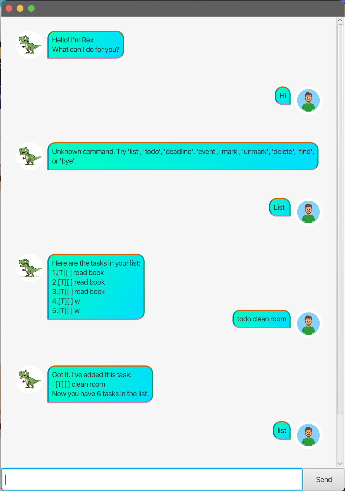

# Rex User Guide



## Introduction
Rex is a simple, command-line driven task manager with a minimal graphical interface.  
It helps you keep track of different kinds of tasks — from basic todos to deadlines and events — so you can stay organised without distractions.  

Rex supports the following main features:
- Add, mark, unmark, list, and delete tasks  
- Manage deadlines and events with date/time information  
- Search for tasks using keywords  
- Save and load your tasks automatically between sessions  

---

## Quick Start
1. Launch the application by running:
   ```bash
   java -jar rex.jar
2. You will see the welcome message and the main UI as shown above.
3. Type a command into the input box and press Enter (or click Send) to execute.
4. Type bye to exit the program.

## Features

### Adding a Todo
Adds a simple task without any date or time.

**Command**
```text
todo <description>
```

**Example**
```text
todo read book
```

**Expected Output**
```text
Got it. I've added this task:
  [T][ ] read book
Now you have 1 task in the list.
```
---
### Adding a Deadline
Adds a task with a due date and time.

**Command**
```text
deadline <description> /by <yyyy-MM-dd HHmm>
```

**Example**
```text
deadline submit assignment /by 2024-12-25 2359
```

**Expected Output**
```text
Got it. I've added this task:
  [D][ ] submit assignment (by: Dec 25 2024, 11:59pm)
Now you have 2 tasks in the list.
```

---
### Adding an Event
Adds a task with a start and end date/time.

**Command**
```text
event <description> /from <yyyy-MM-dd HHmm> /to <yyyy-MM-dd HHmm>
```

**Example**
```text
event project meeting /from 2024-12-20 1400 /to 2024-12-20 1600
```

**Expected Output**
```text
Got it. I've added this task:
  [E][ ] project meeting (from: Dec 20 2024, 2:00pm to: Dec 20 2024, 4:00pm)
Now you have 3 tasks in the list.
```

---
### Listing Tasks
Displays all tasks in the list.

**Command**
```text
list
```

**Expected output**
```text
Here are the tasks in your list:
1.[T][ ] read book
2.[D][ ] submit assignment (by: Dec 25 2024, 11:59pm)
3.[E][ ] project meeting (from: Dec 20 2024, 2:00pm to: Dec 20 2024, 4:00pm)
```

---
### Marking and Unmarking Tasks
Marks or unmarks a task at the given index.

**Commands**
```text
mark <index>
unmark <index>
```

**Example**
```text
mark 1
```

**Expected Output**
```text
Nice! I've marked this task as done:
  [T][X] read book
```

---
### Deleting a Task
Deletes the task at the given index.

**Command**
```text
delete <index>
```

**Example**
```text
delete 2
```

**Expected Output**
```text
Noted. I've removed this task:
  [D][ ] submit assignment (by: Dec 25 2024, 11:59pm)
Now you have 2 tasks in the list.
```

---
### Finding Tasks
Finds all tasks whose description contains the given keyword.

**Command**
```text
find <keyword>
```

**Example**
```text
find read
```

**Expected Output**
```text
Here are the matching tasks in your list:
1.[T][ ] read book
3.[T][ ] read newspaper
```

---
### Exiting the App
Exits the application.

Command
```text
bye
```

Expected Output
```text
Bye. Hope to see you again soon!
```
